# 一.Python安装和开发环境的搭建

## 1.Python的安装

### 1.1下载

[https://www.python.org/downloads/](https://www.python.org/downloads/)

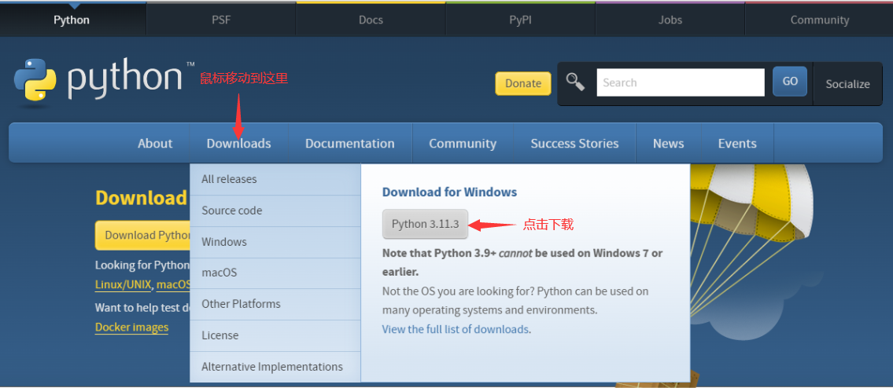

### 1.2安装

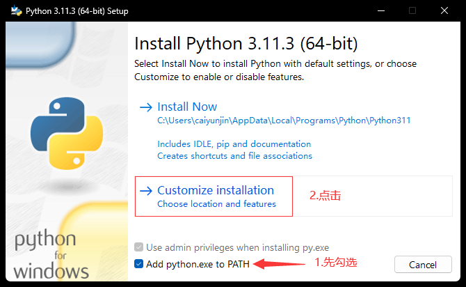

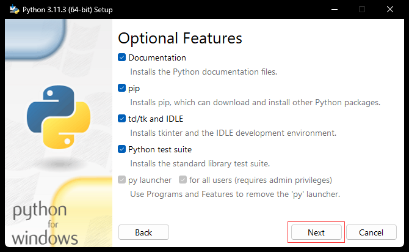

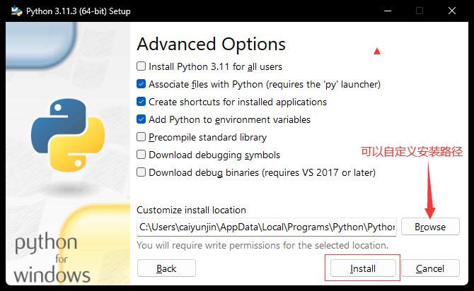


## 2.VSCode的安装

### 2.1下载

[https://code.visualstudio.com/](https://code.visualstudio.com/)


### 2.2安装


### 2.3扩展

#### 2.3.1简体中文

Chinese (Simplified) (简体中文)：汉化

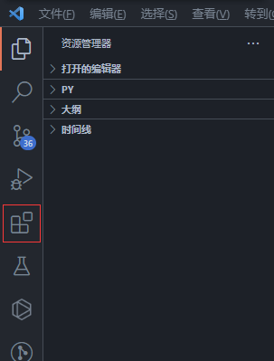


#### 2.3.2Python

Python：VSCode编写Python，必装


#### 2.3.3翻译

翻译(英汉词典)：各种语言互译

安装


设置


#### 2.3.4格式化

##### 2.3.4.1Python代码格式化

Black Formatter：格式化代码，使代码规范、美观

安装

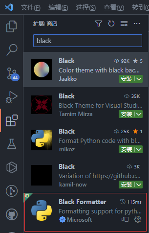

设置


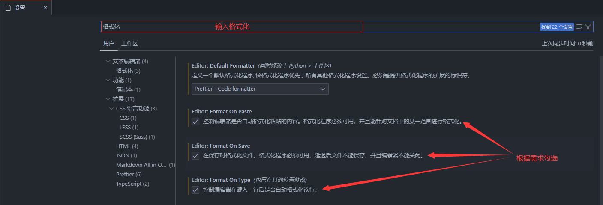

PS：black格式化时默认会把单引号格式化成双引号，如不想修改可设置

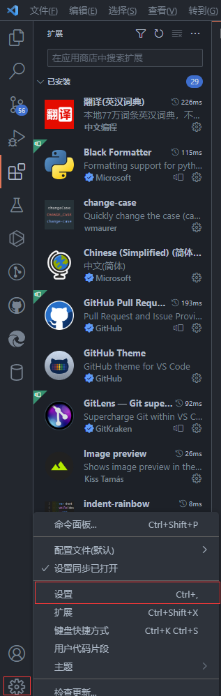

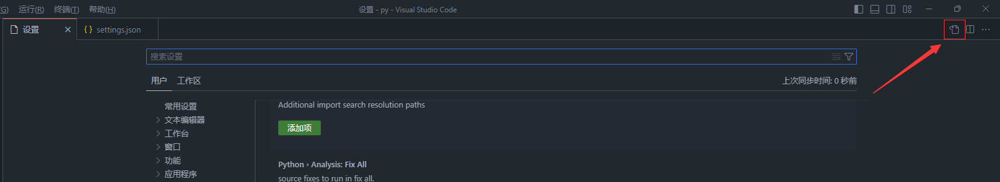

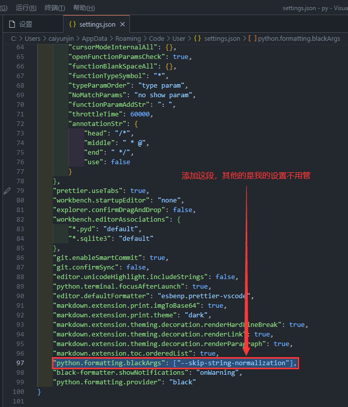

```json
"python.formatting.blackArgs": ["--skip-string-normalization"],
```

##### 2.3.4.2前端代码格式化

Prettier - Code formatter：格式化JavaScript、HTML、CSS、JSON等代码

安装

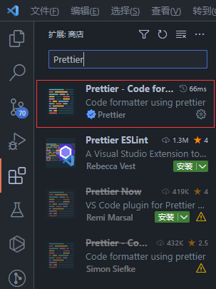

设置

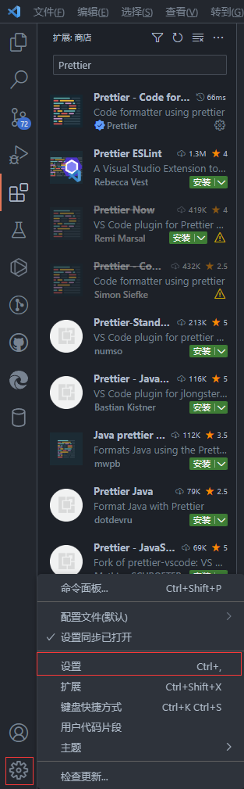


#### 2.3.5主题

##### 2.3.5.1颜色主题

GitHub Theme

安装


设置


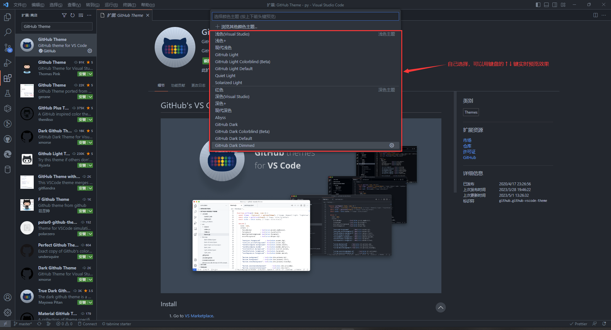

##### 2.3.5.2图标主题

vscode-icons

安装


设置


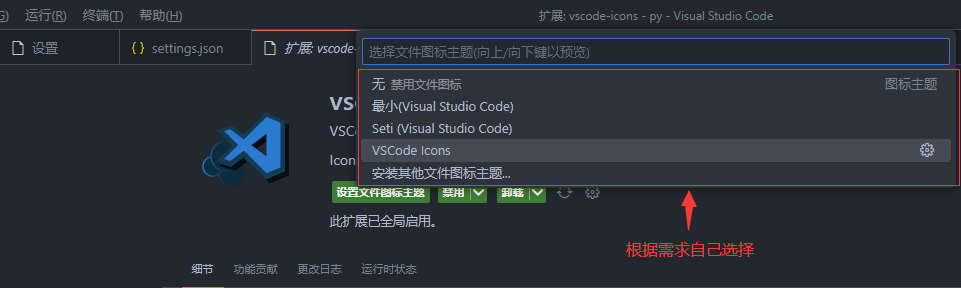

#### 2.3.6图片预览

Image preview：预览代码中插入的图片

安装


设置


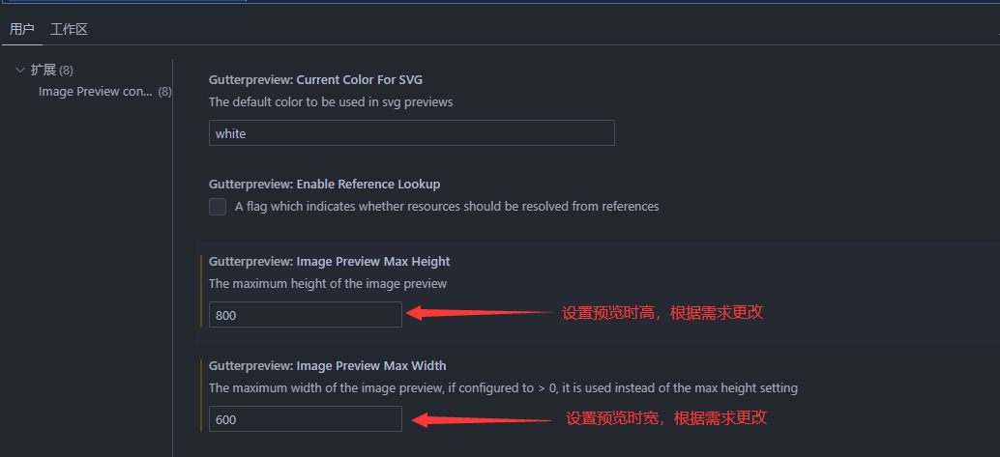

效果

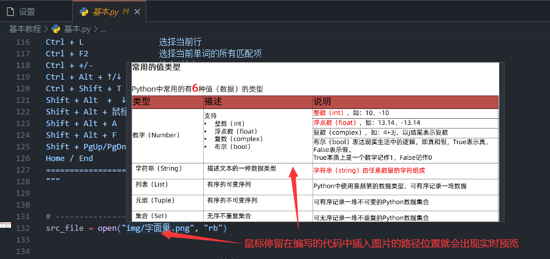

#### 2.3.7缩进

indent-rainbow：根据代码缩进量显示不同颜色，使缩进更直观，对齐更方便

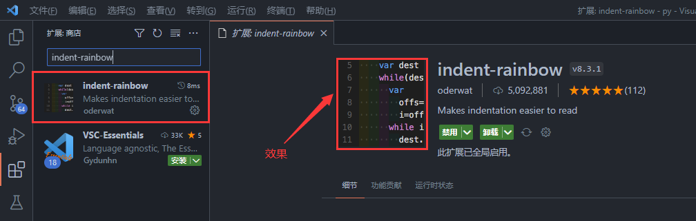

#### 2.3.8注释

koroFileHeader：头部和函数注释

安装


#### 2.3.9网页预览

Live Preview：代码修改实时预览

安装


使用

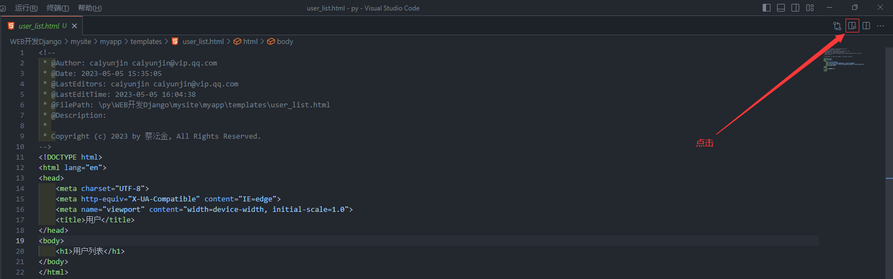

效果

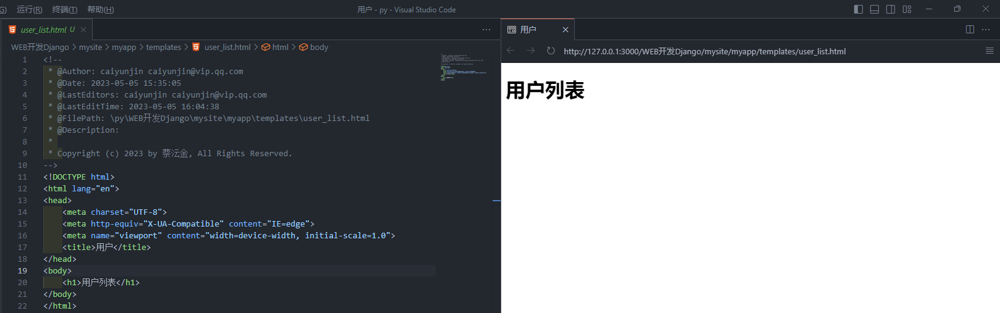

#### 2.3.10正则表达式

Regex Previewer：预览正则表达式效果

安装


#### 2.3.11数据库

SQLTools：管理

SQLTools MySQL/MariaDB：驱动（我用的是MySQL，根据自己用的数据库搜序对应的驱动）

安装


设置


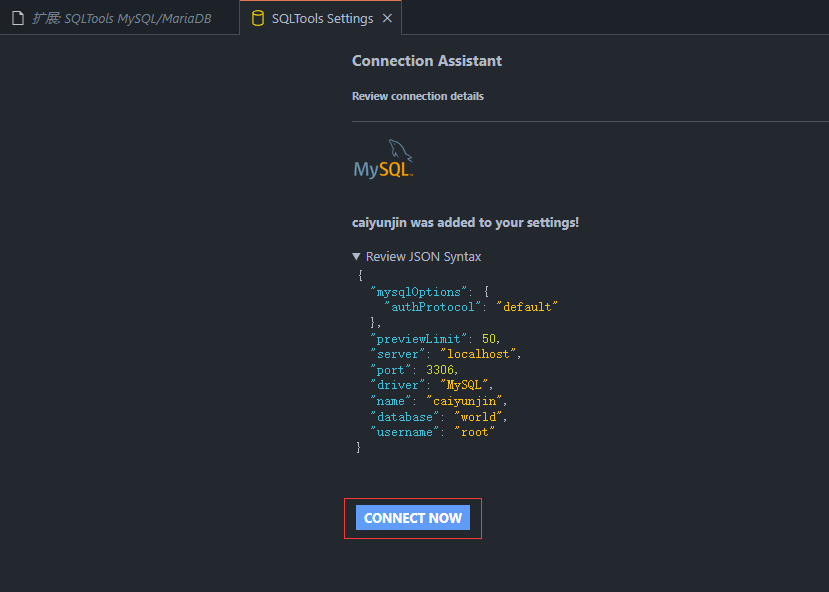


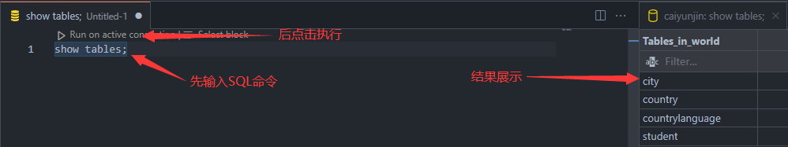

#### 2.3.12代码补全

初学者不建议用，我选择白嫖

1.

[Tabnine AI Autocomplete官网](https://www.tabnine.com/)

Tabnine AI Autocomplete：有免费版（功能限制）和收费版（14天试用，试用结束15美元/月）（能根据用户习惯自动训练，越用越顺手）

安装

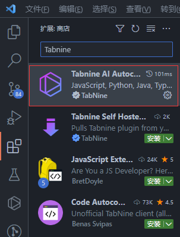

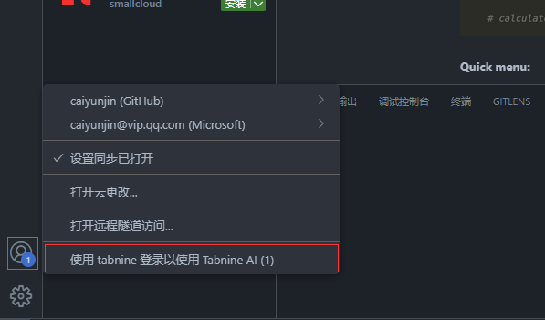

在打开的网页中注册并登录就可以用了

2.

[GitHub Copilot官网](https://github.com/features/copilot/)

GitHub Copilot：基于CHATGPT。试用版（30天）和收费版（10美元/月或100美元/年），学生和教师可申请免费[https://education.github.com/](https://education.github.com/)

