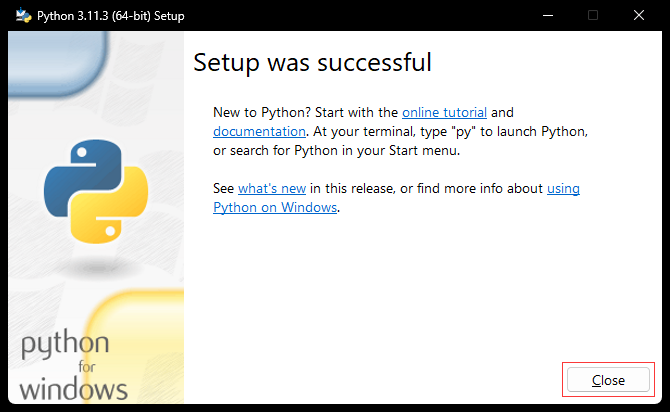
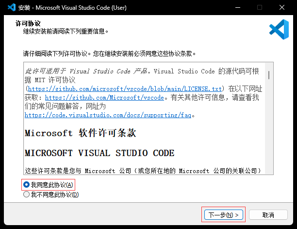
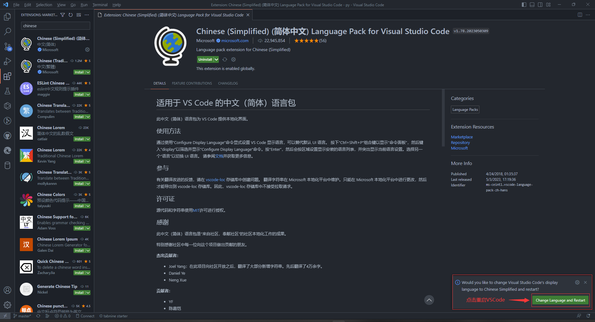
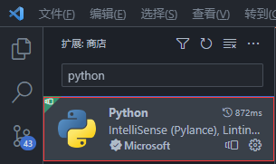
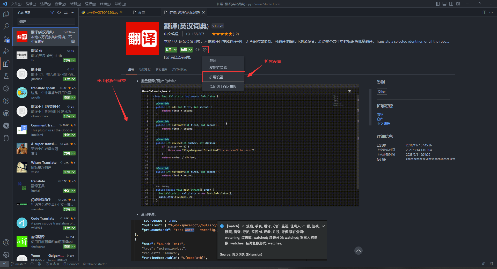
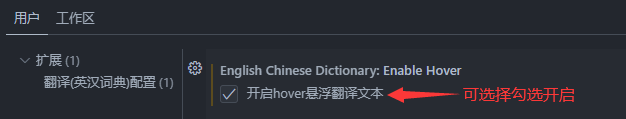
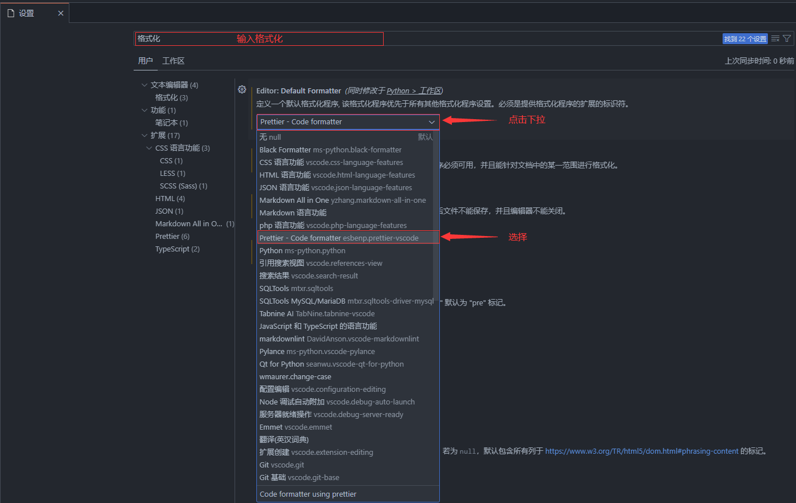
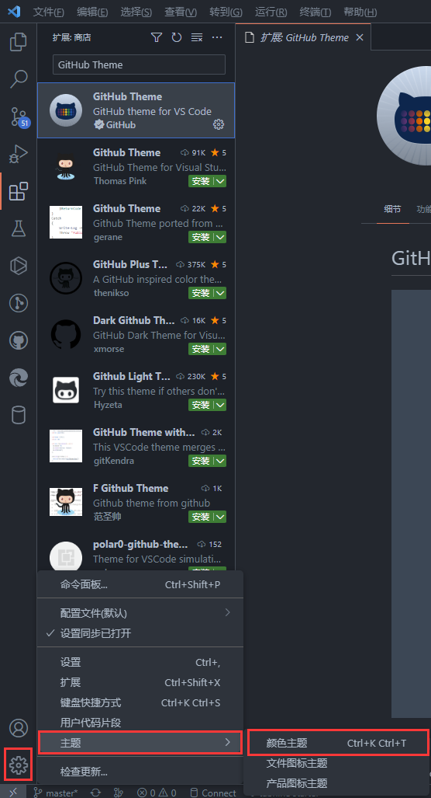
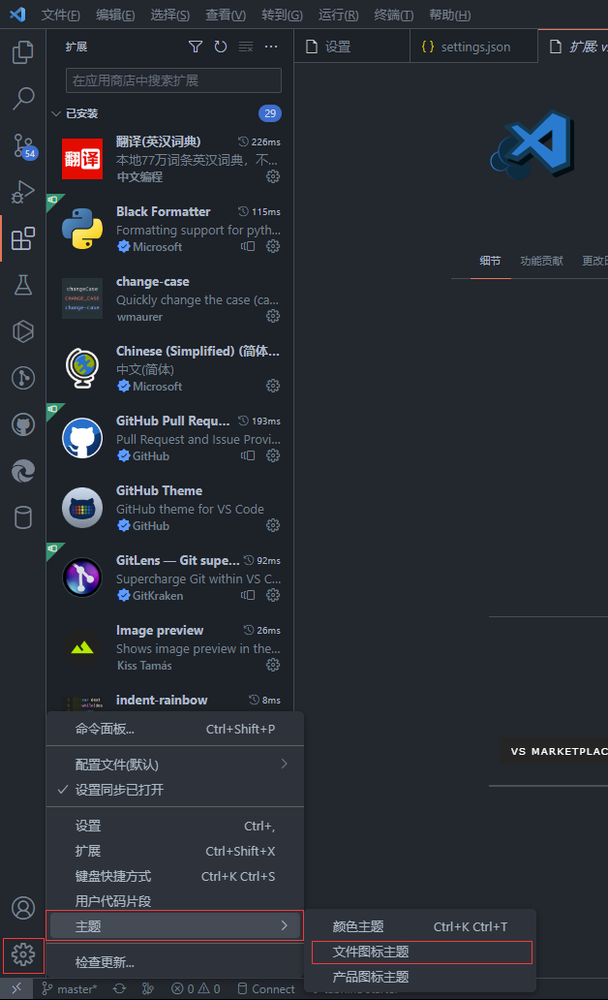
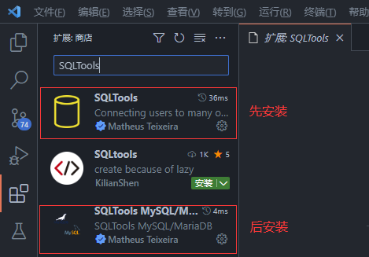

# 一.Python安装和开发环境的搭建

## 1.Python的安装

### 1.1下载

[https://www.python.org/downloads/](https://www.python.org/downloads/)


### 1.2安装




## 2.VSCode的安装

### 2.1下载

[https://code.visualstudio.com/](https://code.visualstudio.com/)


### 2.2安装




### 2.3扩展

#### 2.3.1简体中文

Chinese (Simplified) (简体中文)：汉化




#### 2.3.2Python

Python：VSCode编写Python，必装



#### 2.3.3翻译

翻译(英汉词典)：各种语言互译

安装


设置





#### 2.3.4格式化

##### 2.3.4.1Python代码格式化

Black Formatter：格式化代码，使代码规范、美观

安装


设置


PS：black格式化时默认会把单引号格式化成双引号，如不想修改可设置


```json
"python.formatting.blackArgs": ["--skip-string-normalization"],
```

##### 2.3.4.2前端代码格式化

Prettier - Code formatter：格式化JavaScript、HTML、CSS、JSON等代码

安装


设置




#### 2.3.5主题

##### 2.3.5.1颜色主题

GitHub Theme

安装


设置




##### 2.3.5.2图标主题

vscode-icons

安装


设置




#### 2.3.6图片预览

Image preview：预览代码中插入的图片

安装


设置


效果


#### 2.3.7缩进

indent-rainbow：根据代码缩进量显示不同颜色，使缩进更直观，对齐更方便


#### 2.3.8注释

koroFileHeader：头部和函数注释

安装


#### 2.3.9网页预览

Live Preview：代码修改实时预览

安装


使用


效果


#### 2.3.10正则表达式

Regex Previewer：预览正则表达式效果

安装


#### 2.3.11数据库

SQLTools：管理

SQLTools MySQL/MariaDB：驱动（我用的是MySQL，根据自己用的数据库搜序对应的驱动）

安装



设置


#### 2.3.12代码补全

初学者不建议用，我选择白嫖

1.

[Tabnine AI Autocomplete官网](https://www.tabnine.com/)

Tabnine AI Autocomplete：有免费版（功能限制）和收费版（14天试用，试用结束15美元/月）（能根据用户习惯自动训练，越用越顺手）

安装


在打开的网页中注册并登录就可以用了

2.

[GitHub Copilot官网](https://github.com/features/copilot/)

GitHub Copilot：基于CHATGPT。试用版（30天）和收费版（10美元/月或100美元/年），学生和教师可申请免费[https://education.github.com/](https://education.github.com/)

### 2.4常用快捷键

全部快捷键查看：先按CTRL + K  再按CTRL + S

```
Alt + ↑ / ↓             上下移动行
Alt + Click             多光标和选择
Alt + PgUp / PgDn       向上/向下滚动页面
Alt + Shift             然后拖动鼠标 选择某个区块
Alt + Enter             选择'查找匹配项'的所有出现项
Ctrl + P                快速打开，转到文件
Ctrl + Enter            行下插入
Ctrl + ] / [            行的缩进和缩出
Ctrl + Home / End       跳转到文件首/尾
Ctrl + K + 0            折叠所有（数字0）
Ctrl + K + J            展开所有
Ctrl + K Ctrl + C       添加行注释
Ctrl + K Ctrl + U       删除行注释
Ctrl + T                显示所有符号
Ctrl + G                转到第几行
Ctrl + P                转到某个文件
Ctrl + F                查到
Ctrl + H                替换
Ctrl + D                添加所选内容以查找下一个匹配项
Ctrl + U                撤消上次光标操作
Ctrl + L                选择当前行
Ctrl + F2               选择当前单词的所有匹配项
Ctrl + +/-              放大/缩小
Ctrl + Alt + ↑/↓        在上方/下方插入光标（多选行）
Ctrl + Shift + T        重新打开关闭的编辑器
Shift + Alt  +  ↓ / ↑   复制并粘贴到上下行
Shift + Alt + 鼠标      选择鼠标区域（行列组成的矩形）
Shift + Alt + A         切换块注释
Shift + Alt + F         格式化文档
Shift + PgUp/PgDn       向上/向下滚动页面
Home / End              跳转行头行尾
```

### 2.5第三方库

打开终端：快捷键CTRL + ·或


在终端输入命令

```cmd
pip install 库名
```


网速不行的可以用清华镜像源

```cmd
pip install -i https://pypi.tuna.tsinghua.edu.cn/simple 库名
```


```
------------------------------------爬虫------------------------------------
#请求库
requests 提供了方便的 HTTP 请求和响应处理功能，可以方便地访问 Web API 接口
Selenium 提供 Web 应用程序测试的工具

#解析库
bs4 提供了 HTML 和 XML 解析相关的功能，可以方便地从网页中提取出所需的信息

#存储
pymysql MYSQL库

#图像识别
可用超级鹰识别

#框架
Scrapy 功能极其强大，但依赖库也多

------------------------------------数据------------------------------------
#数据处理
NumPy 高性能的数值计算功能，特别是数组和矩阵，适合处理统一的数值数组数据
Pandas 高效的数据分析和处理工具，处理各种数据格式，专门处理表格和混杂数据

#数据可视化
Matplotlib 提供了数据可视化相关的功能，可以绘制各种图表
pyecharts 相较于Matplotlib，可以绘制更复杂图表

-----------------------------------大数据-----------------------------------
PySpark 海量数据大规模分布式计算


-----------------------------------Web开发----------------------------------
Django 提供了完整的 Web 开发框架，可以方便地搭建高效的 Web 应用程序
Flask 提供了轻量级的 Web 开发框架，可以方便地搭建简单的 Web 应用程序

-----------------------------------GUI开发----------------------------------
PySide6 提供了对 Qt 库的 Python 封装，可以方便地开发图形界面应用程序

-----------------------------------游戏开发---------------------------------
Pygame 游戏、多媒体制作，入门级
Panda3D 开源、跨平台的3D渲染和游戏开发

-------------------------------------文件-----------------------------------
python-docx 用于创建和更新Word文件
python-pptx 用于创建和更新PPT文件
PyPDF2 用于创建和更新PDF文件

-------------------------------------打包-----------------------------------
auto-py-to-exe 图形化打包
```

### 2.6开始编程


# 二.Python基本教程

## 1.字面量


## 2.注释

Python注释：单行注释，#注释内容、多行注释 ，‘’‘注释内容’‘’（一对三单引号或一对三双引号）

## 3.输出

```py
# 输出数字
print(1)
# 输出字符串,单引号和双引号都可以
print('hello world')
print("hello world")
# 输出含有运算符的表达式
print(1 + 1) # 结果为2
# 将数据输出到文件
fp = open("D:/text.txt", "a + ")
print("hello", file=fp)
fp.close()
# 不换行输出
print("hello", "file")
```

## 4.变量

```python
    #变量赋值，把值 张三 赋给 变量 name
    name = "张三"
    # 变量多次赋值，变量值为最后一次赋值
    name = '李四'
    print("值", name) # 所以输出结果为 李四
    print("标识", id(name)) # id() 用于获取对象的内存地址
    print("类型", type(name)) # type() 用于获取对象的类型
```

## 5.数据类型

```python
# 整数 int，十进制（默认）、二进制（0b）、八进制（0o）、十六进制（0x）
# 可以表示 整数、负数、0
print("十进制", 1)
print("二进制", 0b10101111)
print("八进制", 0o175)
print("十六进制", 0x1EA)

# ----------------------------------------------------------------------
# 浮点数-float-3.1415
from decimal import Decimal

n1 = 1.1
n2 = 2.2
print(n1 + n2) # 结果为 3.3000000000000003，这是因为在计算机中，浮点数并不能准确地表示十进制
# 可以通过 Decimal() 高精度计算
print(Decimal("1.1") + Decimal("2.2")) # 结果 3.3

# ----------------------------------------------------------------------
# 布尔类型-True表示条件为真，False表示条件为假。True相当于整数 1、False相当于整数 0
n1 = True
n2 = False
print(n1 + 1) # 结果 2
print(n2 + 1) # 结果 1

# ----------------------------------------------------------------------
# 字符串类型
str1 = '哈哈'
str2 = "哈哈"
str3 = '''哈哈'''
str4 = """哈哈"""
# 输出结果都是 哈哈
print(str1)
print(str2)
print(str3)
print(str4)

# ----------------------------------------------------------------------
# 类型转换 str()转换成字符串类型， int()转换成整数类型，float()转换成浮点数类型
name = "张三"
age = 20
# 字符串和变量的拼接用 +
print("我叫" + name + "," + "今年" + str(age) + "岁") # 结果 我叫张三,今年20岁
```

## 6.标识符

```py
"""
命名：英文 中文（不推荐） 数字（不可出现在开头） 下划线
规则：完全区分大小写，不可使用保留字
"""
import keyword

print(keyword.kwlist) # 打印输出有哪些保留字
```

## 7.运算符

```py
# 运算符优先级 算术运算 > 位运算 > 比较运算 > 布尔运算 > 赋值运算
# ----------------------------------------------------------------------
# 算数运算符
print(1 + 1) # 加
print(1 - 1) # 减
print(1 * 1) # 乘
print(1 / 1) # 除
print(5 // 2) # 整除
print(5 % 2) # 取余
print(5**2) # 幂运算 5的2次方
print(9 // -4) # 一正一负向下取整
print(9 % -4) # 余数 = 被除数 - 除数 * 商
print(-9 % 4)

# ----------------------------------------------------------------------
# 赋值运算符，从右到左
a = b = c = 1  # 链式赋值
a += 1 # a = a + 1
a -= 1 # a = a - 1
a *= 1 # a = a * 1 结果为 int 类型
a /= 1 # a = a / 1 结果为 float 类型
a //= 1 # a = a // 1 结果为 float 类型
a %= 1 # a = a % 1 结果为 float 类型

# ----------------------------------------------------------------------
# 解包运算符
a, b, c = 1, 2, 3 # 变量个数 = 数值个数
print(a, b, c)
a, b, c = b, a, c # 交换赋值
print(a, b, c)

# ----------------------------------------------------------------------
# 比较运算符，结果为bool类型
a = 1
b = 2
print(a > b)
print(a < b)
print(a >= b)
print(a <= b)
print(a == b) # == 比较 a 和 b 的值是否相等， 和 a is b 一样
print(a != b) # != 比较 a 和 b 的值是否不相等，和 a is not b 一样

# ----------------------------------------------------------------------
# 布尔运算符
a = True
b = False
print(a and b)
print(a or b)
print(not a) # 取反

s = "hello world"
print("w" in s)
print("w" not in s)

# ----------------------------------------------------------------------
# 位运算符按照数据在内存中的二进制位进行操作，一般用于底层开发（算法设计、驱动、图像处理、单片机等），在应用层开发（Web 开发、Linux 运维等）中并不常见
print(4 & 8) # 按位与，同为1为1
print(4 | 8) # 按位或，同为0为0
print(4 << 1) # 向左移动一位，相当于乘以2
print(4 >> 1) # 向右移动一位，相当于除以2
```

## 8.字符串

```py
# 转义字符
# 反斜杠"\"代表转义，它会优先尝试和后面的字符串结合起来，组合的字符加一起有特殊含义，就代表转义
print("hello\nworld") # \n 换行
print("hello\tworld") # \t 制表符，默认8个空格，因为hello已经占据5个位置，所以结果为 hello三空格world
print("helloooo\tworld") # 因为helloooo已经占据8个位置，重新计算个数，所以结果为 helloooo八空格world
print("helloooo\rworld") # \r 将\r后面的内容(包括空格)移到所有字符串开头，并逐一替换开头部分的字符，所以结果为 worldooo
print("helloooo\bworld") # \b 退一格，删除了一个o，所以结果为 helloooworld
print("http:\\\\www.example.com") # 因为 \ 代表转义，所以要输出\\ 必须\\\\，所以结果为 http:\\www.example.com

# 一对双引号外边可以再套一对单引号，不能套双引号，反之亦然
print('你说 "大家好"') # 结果为 你说 "大家好"
print("你说 '大家好'") # 结果为 你说 '大家好'
print("你说 \'大家好\'") # 结果为 你说 '大家好'
print(r"你说 \'大家好\'") # r 不执行转义，所以前面加r后，\就不起作用了，所以结果为 你说 \'大家好\'

```


```py
# 查询索引，正向索引0开始，逆向索引-1开始
s = "hello,hello"
print(s[0]) # 结果为 h
print(s[-1]) # 结果为 o
# index()查找子串第一次出现的位置，如果不存在则抛出异常
print(s.index("lo")) # 结果为 3
# rindex()查找子串最后一次出现的位置，如果不存在则抛出异常
print(s.rindex("lo")) # 结果为 9
# find()查找子串第一次出现的位置，如果不存在则返回-1
print(s.find("lo")) # 结果为 3
# rfind()查找子串最后一次出现的位置，如果不存在则返回-1
print(s.rfind("lo")) # 结果为 9

# ----------------------------------------------------------------------
# 大小写转换
s = "Hello,hEllO"
a = s.upper() # 小写转大写
print(a)
a = s.lower() # 大写转小写
print(a)
a = s.swapcase() # 大小写互换
print(a)
a = s.capitalize() # 首字母大写，其余小写
print(a)
a = s.title() # 每个单词首字母大写，其余小写
print(a)

# ----------------------------------------------------------------------
# 内容对齐
s2 = "hello world"
# 居中
print(s2.center(20, "*"))  # 宽度20，填充*，默认空格。结果为 ****hello world*****
# 左对齐
print(s2.ljust(20,"*")) # 结果为 hello world*********
# 右对齐
print(s2.rjust(20,"*")) # 结果为 *********hello world
# 右对齐，使用0填充
print(s2.zfill(20))  # 只能用0填充，结果为 000000000hello world

# ----------------------------------------------------------------------
# 分割，split()可以对字符串按照指定规则分割，并将分割后的字段以list返回
s2 = "hello world"
lst = s2.split()
print(lst) # 结果为 ['hello', 'world']
# sep指定分隔符，maxsplit指定次数
s2 = "hello|world|python"
print(s2.split(sep="|")) # 结果为 ['hello', 'world', 'python']
print(s2.split(sep="|", maxsplit=1)) # 结果为 ['hello', 'world|python']
# 逆向
print(s2.rsplit(sep="|")) # 结果为 ['hello', 'world', 'python']
print(s2.rsplit(sep="|", maxsplit=1)) # 结果为 ['hello|world', 'python']

# ----------------------------------------------------------------------
# 判断标识符
s.isidentifier()  # 判断是否合法标识符
s.isspace()  # 判断是否全部由空白字符组成（回车、换行、水平制表符）
s.isalpha()  # 判断是否全部由字母组成
s.isdecimal()  # 判断是否全部由十进制的数字组成
s.isnumeric()  # 判断是否全部由数字组成
s.isalnum()  # 判断是否全部由字母和数字组成

# ----------------------------------------------------------------------
# 替换
s = "hello world"
print(s.replace("hello", "b"))
s1 = "hello hello hello world"
print(s1.replace("hello", "b", 2))  # 指定替换数量

# ----------------------------------------------------------------------
# 添加任意数量的字符串（包括要连接的元素字符串、元组、列表、字典），用新的目标分隔符连接，返回新的字符串。
lst = ["hello", "world", "world"]
print("|".join(lst)) # 结果为 hello|world|world
print("".join(lst)) # 结果为 helloworldworld
print("*".join("python")) # 结果为 p*y*t*h*o*n

# ----------------------------------------------------------------------
# 格式化
# % 占位符 %s->字符串 %d->整数 %f->浮点数
# 精度控制 例如 %5d 宽度为5，不足的前面补空格。%5.2f 宽度为5（包括小数），小数为2，不足的前面补空格。.2f，可不带宽度

# 1
name = "张三"
age = 18
print("我叫%s,今年%d岁" % (name, age)) # 结果为 我叫张三,今年18岁

# 2
print("我叫{0},今年{1}岁".format(name, age)) # 结果为 我叫张三,今年18岁

# 3
print(f"我叫{name},今年{age}岁") # 结果为 我叫张三,今年18岁

#
print("%d" % 88) # 结果为 88
# 10 表示宽度
print("%10d" % 88) # 结果为 八个空格88
# 3 表示小数点后三位，后面四舍五入
print("%.3f" % 3.14156)  # 结果为 3.142
# 10 表示宽度，3 表示小数点后三位，后面四舍五入
print("%10.3f" % 3.14156) # 结果为 五个空格3.142
# 总共三位数，后面四舍五入
print("{0:.3}".format(3.14156)) # 结果为 3.14
# 小数点后三位数，后面四舍五入
print("{0:.3f}".format(3.14156)) # 结果为 3.142
# 10表示宽度，小数点后三位数，后面四舍五入
print("{0:10.3f}".format(3.14156)) # 结果为 五个空格3.142

# ----------------------------------------------------------------------
# 编码
s = "张三"
# gbk 编码中，一个中文占两个字节
print(s.encode(encoding="GBK"))
# utf-8 编码中，一个中文占三个字节
print(s.encode(encoding="utf-8"))  

# ----------------------------------------------------------------------
# 解码
byte = s.encode(encoding="GBK")
print(byte.decode(encoding="GBK"))

byte = s.encode(encoding="utf-8")
print(byte.decode(encoding="utf-8"))
```

