# 一.Python安装和开发环境的搭建

## 1.Python的安装

### 1.1下载

[https://www.python.org/downloads/](https://www.python.org/downloads/)


### 1.2安装

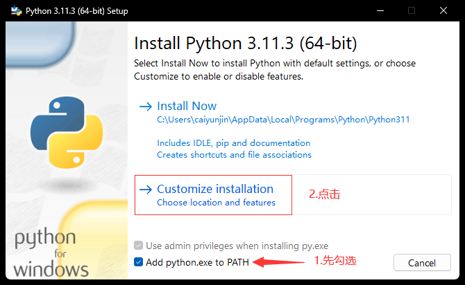


## 2.VSCode的安装

### 2.1下载

[https://code.visualstudio.com/](https://code.visualstudio.com/)


### 2.2安装

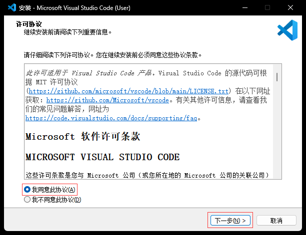


### 2.3扩展

```
翻译(英汉词典)                       翻译
Black Formatter                     格式化
Chinese (Simplified)                简体中文
GitHub Pull requests and Issues     查看和管理GitHub拉取请求和问题
GitHub Theme                        主题
GitLens — Git supercharged          最后一次提交的作者、时间、信息
Image preview                       图片预览
indent-rainbow                      不同颜色高亮显示缩进
koroFileHeader                      头部注释和函数注释
Live Preview                        同步预览
Markdown All in One                 Markdown工具
Markdown Preview Github Styling     Github使用的Markdown渲染样式
markdownlint                        Markdown 格式检查工具
Microsoft Edge Tools for VS Code    前端调试
Prettier - Code formatter           前端代码格式化
Qt for Python                       QT官方插件
Regex Previewer                     正则表达式预览
SQLTools                            数据库管理
SQLTools MySQL/MariaDB              数据库驱动
Tabnine AI Autocomplete             智能代码补全
vscode-icons                        图标
```


#### 2.3.1简体中文

Chinese (Simplified) (简体中文)：汉化


#### 2.3.2Python

Python：VSCode编写Python，必装

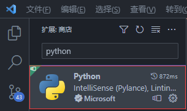

#### 2.3.3翻译

翻译(英汉词典)：各种语言互译

安装


设置

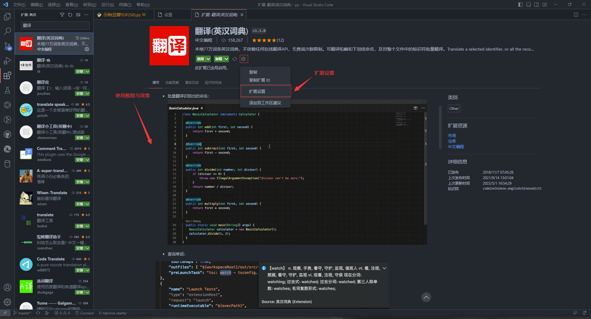


#### 2.3.4格式化

##### 2.3.4.1Python代码格式化

Black Formatter：格式化代码，使代码规范、美观

安装


设置


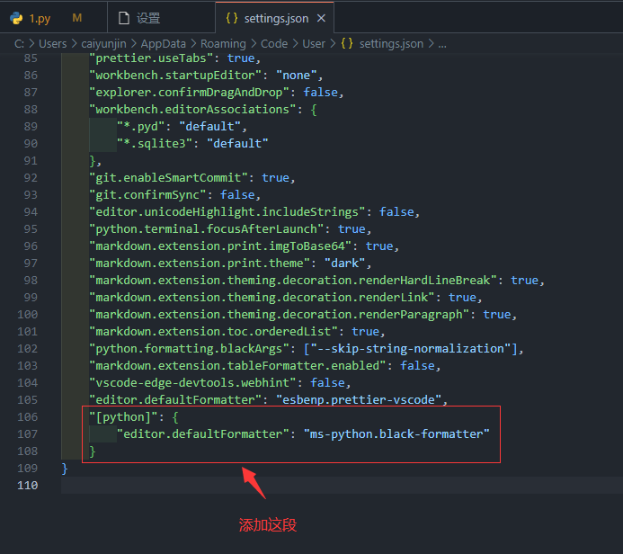

```
"[python]": {
    "editor.defaultFormatter": "ms-python.black-formatter"
}
```

PS：black格式化时默认会把单引号格式化成双引号，如不想修改可设置

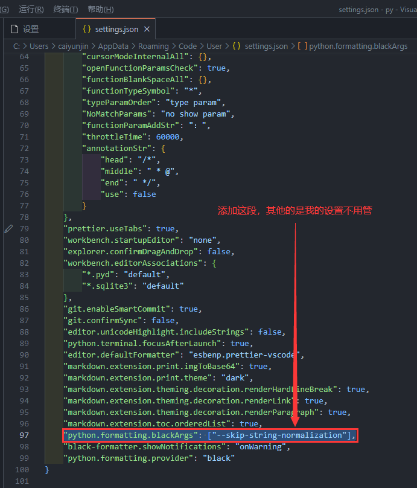

```json
"python.formatting.blackArgs": ["--skip-string-normalization"],
```

##### 2.3.4.2前端代码格式化

Prettier - Code formatter：格式化JavaScript、HTML、CSS、JSON等代码

安装

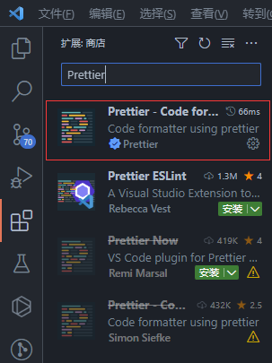

设置


#### 2.3.5主题

##### 2.3.5.1颜色主题

GitHub Theme

安装


设置


##### 2.3.5.2图标主题

vscode-icons

安装


设置


#### 2.3.6图片预览

Image preview：预览代码中插入的图片

安装

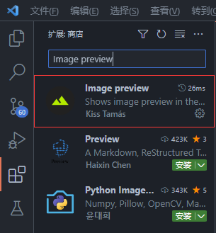

设置


效果


#### 2.3.7缩进

indent-rainbow：根据代码缩进量显示不同颜色，使缩进更直观，对齐更方便


#### 2.3.8注释

koroFileHeader：头部和函数注释

安装


#### 2.3.9网页预览

Live Preview：代码修改实时预览

安装


使用


效果


#### 2.3.10正则表达式

Regex Previewer：预览正则表达式效果

安装


#### 2.3.11数据库

SQLTools：管理

SQLTools MySQL/MariaDB：驱动（我用的是MySQL，根据自己用的数据库搜序对应的驱动）

安装


设置


#### 2.3.12代码补全

初学者不建议用，我选择白嫖

1.

[Tabnine AI Autocomplete官网](https://www.tabnine.com/)

Tabnine AI Autocomplete：有免费版（功能限制）和收费版（14天试用，试用结束15美元/月）（能根据用户习惯自动训练，越用越顺手）

安装


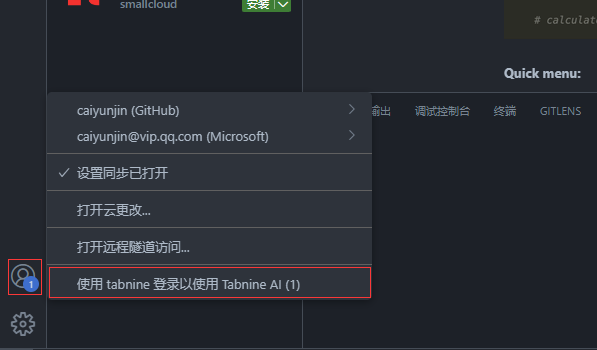

在打开的网页中注册并登录就可以用了

2.

[GitHub Copilot官网](https://github.com/features/copilot/)

GitHub Copilot：基于CHATGPT。试用版（30天）和收费版（10美元/月或100美元/年），学生和教师可申请免费[https://education.github.com/](https://education.github.com/)

### 2.4常用快捷键

全部快捷键查看：先按CTRL + K  再按CTRL + S

```
Alt + ↑ / ↓             上下移动行
Alt + Click             多光标和选择
Alt + PgUp / PgDn       向上/向下滚动页面
Alt + Shift             然后拖动鼠标 选择某个区块
Alt + Enter             选择'查找匹配项'的所有出现项
Ctrl + P                快速打开，转到文件
Ctrl + Enter            行下插入
Ctrl + ] / [            行的缩进和缩出
Ctrl + Home / End       跳转到文件首/尾
Ctrl + K + 0            折叠所有（数字0）
Ctrl + K + J            展开所有
Ctrl + K Ctrl + C       添加行注释
Ctrl + K Ctrl + U       删除行注释
Ctrl + T                显示所有符号
Ctrl + G                转到第几行
Ctrl + P                转到某个文件
Ctrl + F                查到
Ctrl + H                替换
Ctrl + D                添加所选内容以查找下一个匹配项
Ctrl + U                撤消上次光标操作
Ctrl + L                选择当前行
Ctrl + F2               选择当前单词的所有匹配项
Ctrl + +/-              放大/缩小
Ctrl + Alt + ↑/↓        在上方/下方插入光标（多选行）
Ctrl + Shift + T        重新打开关闭的编辑器
Shift + Alt  +  ↓ / ↑   复制并粘贴到上下行
Shift + Alt + 鼠标      选择鼠标区域（行列组成的矩形）
Shift + Alt + A         切换块注释
Shift + Alt + F         格式化文档
Shift + PgUp/PgDn       向上/向下滚动页面
Home / End              跳转行头行尾
```

### 2.5第三方库

打开终端：快捷键CTRL + ·或

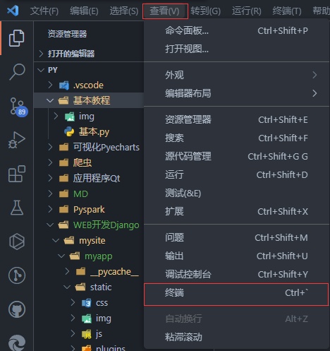

在终端输入命令

```cmd
pip install 库名
```

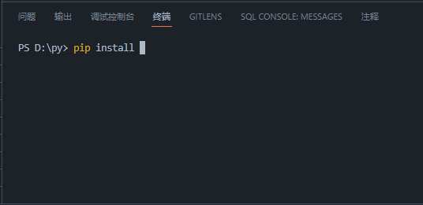

网速不行的可以用清华镜像源

```cmd
pip install -i https://pypi.tuna.tsinghua.edu.cn/simple 库名
```

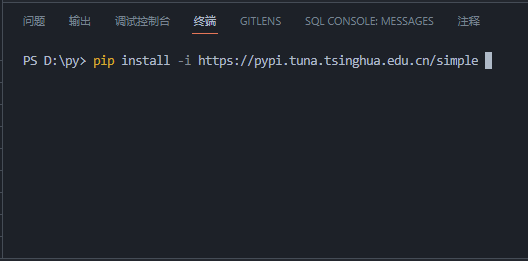

```
------------------------------------爬虫------------------------------------
#请求库
requests 提供了方便的 HTTP 请求和响应处理功能，可以方便地访问 Web API 接口
Selenium 提供 Web 应用程序测试的工具

#解析库
bs4 提供了 HTML 和 XML 解析相关的功能，可以方便地从网页中提取出所需的信息

#存储
pymysql MYSQL库

#图像识别
可用超级鹰识别

#框架
Scrapy 功能极其强大，但依赖库也多

------------------------------------数据------------------------------------
#数据处理
NumPy 高性能的数值计算功能，特别是数组和矩阵，适合处理统一的数值数组数据
Pandas 高效的数据分析和处理工具，处理各种数据格式，专门处理表格和混杂数据

#数据可视化
Matplotlib 提供了数据可视化相关的功能，可以绘制各种图表
pyecharts 相较于Matplotlib，可以绘制更复杂图表

-----------------------------------大数据-----------------------------------
PySpark 海量数据大规模分布式计算


-----------------------------------Web开发----------------------------------
Django 提供了完整的 Web 开发框架，可以方便地搭建高效的 Web 应用程序
Flask 提供了轻量级的 Web 开发框架，可以方便地搭建简单的 Web 应用程序

-----------------------------------GUI开发----------------------------------
PySide6 提供了对 Qt 库的 Python 封装，可以方便地开发图形界面应用程序

-----------------------------------游戏开发---------------------------------
Pygame 游戏、多媒体制作，入门级
Panda3D 开源、跨平台的3D渲染和游戏开发

-------------------------------------文件-----------------------------------
python-docx 用于创建和更新Word文件
python-pptx 用于创建和更新PPT文件
PyPDF2 用于创建和更新PDF文件

-------------------------------------打包-----------------------------------
auto-py-to-exe 图形化打包
```

### 2.6开始编程


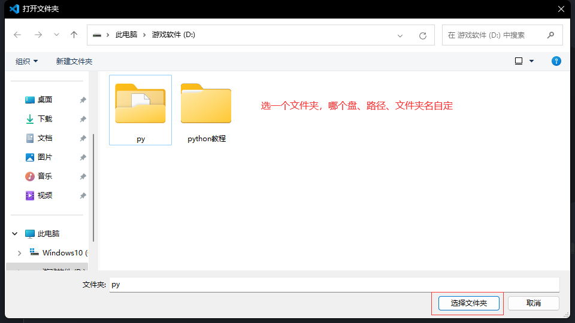


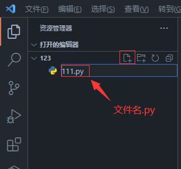


# 二.Python基本教程

## 1.字面量


## 2.注释

Python注释：单行注释，#注释内容、多行注释 ，‘’‘注释内容’‘’（一对三单引号或一对三双引号）

## 3.输出

```py
# 输出数字
print(1)
# 输出字符串,单引号和双引号都可以
print('hello world')
print("hello world")
# 输出含有运算符的表达式
print(1 + 1) # 结果为2
# 将数据输出到文件
fp = open("D:/text.txt", "a + ")
print("hello", file=fp)
fp.close()
# 不换行输出
print("hello", "file")
```

## 4.变量

```python
    #变量赋值，把值 张三 赋给 变量 name
    name = "张三"
    # 变量多次赋值，变量值为最后一次赋值
    name = '李四'
    print("值", name) # 所以输出结果为 李四
    print("标识", id(name)) # id() 用于获取对象的内存地址
    print("类型", type(name)) # type() 用于获取对象的类型
```

## 5.数据类型

```python
# 整数 int，十进制（默认）、二进制（0b）、八进制（0o）、十六进制（0x）
# 可以表示 整数、负数、0
print("十进制", 1)
print("二进制", 0b10101111)
print("八进制", 0o175)
print("十六进制", 0x1EA)

# ----------------------------------------------------------------------
# 浮点数-float-3.1415
from decimal import Decimal

n1 = 1.1
n2 = 2.2
print(n1 + n2) # 结果为 3.3000000000000003，这是因为在计算机中，浮点数并不能准确地表示十进制
# 可以通过 Decimal() 高精度计算
print(Decimal("1.1") + Decimal("2.2")) # 结果 3.3

# ----------------------------------------------------------------------
# 布尔类型-True表示条件为真，False表示条件为假。True相当于整数 1、False相当于整数 0
n1 = True
n2 = False
print(n1 + 1) # 结果 2
print(n2 + 1) # 结果 1

# ----------------------------------------------------------------------
# 字符串类型
str1 = '哈哈'
str2 = "哈哈"
str3 = '''哈哈'''
str4 = """哈哈"""
# 输出结果都是 哈哈
print(str1)
print(str2)
print(str3)
print(str4)

# ----------------------------------------------------------------------
# 类型转换 str()转换成字符串类型， int()转换成整数类型，float()转换成浮点数类型
name = "张三"
age = 20
# 字符串和变量的拼接用 +
print("我叫" + name + "," + "今年" + str(age) + "岁") # 结果 我叫张三,今年20岁
```

## 6.标识符

```py
"""
命名：英文 中文（不推荐） 数字（不可出现在开头） 下划线
规则：完全区分大小写，不可使用保留字
"""
import keyword

print(keyword.kwlist) # 打印输出有哪些保留字
```

## 7.运算符

```py
# 运算符优先级 算术运算 > 位运算 > 比较运算 > 布尔运算 > 赋值运算
# ----------------------------------------------------------------------
# 算数运算符
print(1 + 1) # 加
print(1 - 1) # 减
print(1 * 1) # 乘
print(1 / 1) # 除
print(5 // 2) # 整除
print(5 % 2) # 取余
print(5**2) # 幂运算 5的2次方
print(9 // -4) # 一正一负向下取整
print(9 % -4) # 余数 = 被除数 - 除数 * 商
print(-9 % 4)

# ----------------------------------------------------------------------
# 赋值运算符，从右到左
a = b = c = 1  # 链式赋值
a += 1 # a = a + 1
a -= 1 # a = a - 1
a *= 1 # a = a * 1 结果为 int 类型
a /= 1 # a = a / 1 结果为 float 类型
a //= 1 # a = a // 1 结果为 float 类型
a %= 1 # a = a % 1 结果为 float 类型

# ----------------------------------------------------------------------
# 解包运算符
a, b, c = 1, 2, 3 # 变量个数 = 数值个数
print(a, b, c)
a, b, c = b, a, c # 交换赋值
print(a, b, c)

# ----------------------------------------------------------------------
# 比较运算符，结果为bool类型
a = 1
b = 2
print(a > b)
print(a < b)
print(a >= b)
print(a <= b)
print(a == b) # == 比较 a 和 b 的值是否相等， 和 a is b 一样
print(a != b) # != 比较 a 和 b 的值是否不相等，和 a is not b 一样

# ----------------------------------------------------------------------
# 布尔运算符
a = True
b = False
print(a and b)
print(a or b)
print(not a) # 取反

s = "hello world"
print("w" in s)
print("w" not in s)

# ----------------------------------------------------------------------
# 位运算符按照数据在内存中的二进制位进行操作，一般用于底层开发（算法设计、驱动、图像处理、单片机等），在应用层开发（Web 开发、Linux 运维等）中并不常见
print(4 & 8) # 按位与，同为1为1
print(4 | 8) # 按位或，同为0为0
print(4 << 1) # 向左移动一位，相当于乘以2
print(4 >> 1) # 向右移动一位，相当于除以2
```

## 8.字符串

```py
# 转义字符
# 反斜杠"\"代表转义，它会优先尝试和后面的字符串结合起来，组合的字符加一起有特殊含义，就代表转义
print("hello\nworld") # \n 换行
print("hello\tworld") # \t 制表符，默认8个空格，因为hello已经占据5个位置，所以结果为 hello三空格world
print("helloooo\tworld") # 因为helloooo已经占据8个位置，重新计算个数，所以结果为 helloooo八空格world
print("helloooo\rworld") # \r 将\r后面的内容(包括空格)移到所有字符串开头，并逐一替换开头部分的字符，所以结果为 worldooo
print("helloooo\bworld") # \b 退一格，删除了一个o，所以结果为 helloooworld
print("http:\\\\www.example.com") # 因为 \ 代表转义，所以要输出\\ 必须\\\\，所以结果为 http:\\www.example.com

# 一对双引号外边可以再套一对单引号，不能套双引号，反之亦然
print('你说 "大家好"') # 结果为 你说 "大家好"
print("你说 '大家好'") # 结果为 你说 '大家好'
print("你说 \'大家好\'") # 结果为 你说 '大家好'
print(r"你说 \'大家好\'") # r 不执行转义，所以前面加r后，\就不起作用了，所以结果为 你说 \'大家好\'

```


```py
# 查询索引，正向索引0开始，逆向索引-1开始
s = "hello,hello"
print(s[0]) # 结果为 h
print(s[-1]) # 结果为 o
# index()查找子串第一次出现的位置，如果不存在则抛出异常
print(s.index("lo")) # 结果为 3
# rindex()查找子串最后一次出现的位置，如果不存在则抛出异常
print(s.rindex("lo")) # 结果为 9
# find()查找子串第一次出现的位置，如果不存在则返回-1
print(s.find("lo")) # 结果为 3
# rfind()查找子串最后一次出现的位置，如果不存在则返回-1
print(s.rfind("lo")) # 结果为 9

# ----------------------------------------------------------------------
# 大小写转换
s = "Hello,hEllO"
a = s.upper() # 小写转大写
print(a)
a = s.lower() # 大写转小写
print(a)
a = s.swapcase() # 大小写互换
print(a)
a = s.capitalize() # 首字母大写，其余小写
print(a)
a = s.title() # 每个单词首字母大写，其余小写
print(a)

# ----------------------------------------------------------------------
# 内容对齐
s2 = "hello world"
# 居中
print(s2.center(20, "*"))  # 宽度20，填充*，默认空格。结果为 ****hello world*****
# 左对齐
print(s2.ljust(20,"*")) # 结果为 hello world*********
# 右对齐
print(s2.rjust(20,"*")) # 结果为 *********hello world
# 右对齐，使用0填充
print(s2.zfill(20))  # 只能用0填充，结果为 000000000hello world

# ----------------------------------------------------------------------
# 分割，split()可以对字符串按照指定规则分割，并将分割后的字段以list返回
s2 = "hello world"
lst = s2.split()
print(lst) # 结果为 ['hello', 'world']
# sep指定分隔符，maxsplit指定次数
s2 = "hello|world|python"
print(s2.split(sep="|")) # 结果为 ['hello', 'world', 'python']
print(s2.split(sep="|", maxsplit=1)) # 结果为 ['hello', 'world|python']
# 逆向
print(s2.rsplit(sep="|")) # 结果为 ['hello', 'world', 'python']
print(s2.rsplit(sep="|", maxsplit=1)) # 结果为 ['hello|world', 'python']

# ----------------------------------------------------------------------
# 判断标识符
s.isidentifier()  # 判断是否合法标识符
s.isspace()  # 判断是否全部由空白字符组成（回车、换行、水平制表符）
s.isalpha()  # 判断是否全部由字母组成
s.isdecimal()  # 判断是否全部由十进制的数字组成
s.isnumeric()  # 判断是否全部由数字组成
s.isalnum()  # 判断是否全部由字母和数字组成

# ----------------------------------------------------------------------
# 替换
s = "hello world"
print(s.replace("hello", "b"))
s1 = "hello hello hello world"
print(s1.replace("hello", "b", 2))  # 指定替换数量

# ----------------------------------------------------------------------
# 添加任意数量的字符串（包括要连接的元素字符串、元组、列表、字典），用新的目标分隔符连接，返回新的字符串。
lst = ["hello", "world", "world"]
print("|".join(lst)) # 结果为 hello|world|world
print("".join(lst)) # 结果为 helloworldworld
print("*".join("python")) # 结果为 p*y*t*h*o*n

# ----------------------------------------------------------------------
# 格式化
# % 占位符 %s->字符串 %d->整数 %f->浮点数
# 精度控制 例如 %5d 宽度为5，不足的前面补空格。%5.2f 宽度为5（包括小数），小数为2，不足的前面补空格。.2f，可不带宽度

# 1
name = "张三"
age = 18
print("我叫%s,今年%d岁" % (name, age)) # 结果为 我叫张三,今年18岁

# 2
print("我叫{0},今年{1}岁".format(name, age)) # 结果为 我叫张三,今年18岁

# 3
print(f"我叫{name},今年{age}岁") # 结果为 我叫张三,今年18岁

#
print("%d" % 88) # 结果为 88
# 10 表示宽度
print("%10d" % 88) # 结果为 八个空格88
# 3 表示小数点后三位，后面四舍五入
print("%.3f" % 3.14156)  # 结果为 3.142
# 10 表示宽度，3 表示小数点后三位，后面四舍五入
print("%10.3f" % 3.14156) # 结果为 五个空格3.142
# 总共三位数，后面四舍五入
print("{0:.3}".format(3.14156)) # 结果为 3.14
# 小数点后三位数，后面四舍五入
print("{0:.3f}".format(3.14156)) # 结果为 3.142
# 10表示宽度，小数点后三位数，后面四舍五入
print("{0:10.3f}".format(3.14156)) # 结果为 五个空格3.142

# ----------------------------------------------------------------------
# 编码
s = "张三"
# gbk 编码中，一个中文占两个字节
print(s.encode(encoding="GBK"))
# utf-8 编码中，一个中文占三个字节
print(s.encode(encoding="utf-8"))  

# ----------------------------------------------------------------------
# 解码
byte = s.encode(encoding="GBK")
print(byte.decode(encoding="GBK"))

byte = s.encode(encoding="utf-8")
print(byte.decode(encoding="utf-8"))
```

## 9.输入

```py
# input()，接收用户输入的内容，类型为字符串，所以你输入数字类型也为字符串
a = int(input("请输入一个数字：")) # 将用户输入的字符串转int类型
b = int(input("请输入另一个数字：")) # 将用户输入的字符串转int类型
print(a + b)
```

## 10.判断

```py
# if--else
# 第一种写法
a1 = 1
a2 = 2
if a1 >= a2: # 如果条件为True，执行下面代码
    print(a1, "大于等于", a2) 
else: # 相反为flase，执行下面代码
    print(a1, "小于", a2) # 1 >= 2为false，所以程序会输出这一条内容

# 第二种写法
a1 = 1
a2 = 2
print(str(a1) + "大于等于" + str(a2) if a1 >= a2 else str(a1) + "小于" + str(a2))

# pass是占位符
a1 = 1
a2 = 2
if a1 >= a2:
    print(a1, "大于等于", a2)
else:
    pass # 当下想不出要编写哪些执行代码，可用pass占位，方便以后添加，不然程序会报错

# ----------------------------------------------------------------------
# if--elif--else
if True:
    pass
elif True:
    pass
else:
    pass

# ----------------------------------------------------------------------
# 嵌套
if True:
    pass
    if True:
        pass
    else:
        pass
else:
    pass
```

## 11.循环

```py
# range() 用于生成一系列连续的整数
r = range(10)  # 0-9
print(list(r))

r = range(1, 10)  # 1-9
print(list(r))

r = range(1, 10, 2)  # 1-9 相隔2
print(list(r))

# ----------------------------------------------------------------------
# while 循环，当条件为真，会一直循环执行
# 定义变量 a 和 sum 的初始值
a = 1
sum = 0
while a <= 100: # 定义 a 的范围
    # 偶数和
    if a % 2 == 0:  # if not bool(a % 2) 奇数和
        sum += a # sum = sum + a
    a += 1 # a = a + 1
print(sum) # 结果为 2550

# ----------------------------------------------------------------------
# for in 循环，遍历任何序列的对象
for item in "python": # 遍历字符串
    print(item)

for i in range(10):
    print(i)

for _ in range(10): # _ 代表临时变量
    print("python") # 结果为 输出10次python

# break 跳出循环 continue继续循环
for i in range(1, 10):
    if i % 5 == 0:
        break
    else:
        print(i)

for i in range(1, 10):
    if i % 5 != 0:
        continue
    print(i)

# ----------------------------------------------------------------------
# 嵌套循环
# for in 九九乘法表
for i in range(1, 10):
    for j in range(1, i + 1):
        print(i, "*", j, "=", i * j, end="\t")
    print() # print空内容，就是输出一个换行

# while 九九乘法表
i = 1
while i <= 9:
    # 定义内层循环的控制变量
    j = 1
    while j <= i:
        # 内层循环的print语句，不要换行，通过\t制表符进行对齐
        print(f"{j} * {i} = {j * i}\t", end="")
        j += 1
    i += 1
    print()
    
# ----------------------------------------------------------------------  
# 二重循环
for i in range(1, 10):
    for j in range(1, 11):
        if j % 2 == 0:
            continue
        print(j, end="\t")
    print()
```

## 12.函数

函数是对数据与代码的封装,实现了代码的重复使用

函数分四类：

```
1.内置函数，如 list()、int()等
2.标准库函数，需要用 import 语句导入，如time、os
3.第三方库，需要下载，再用 import 语句导入
4.自己定义的函数
```

```py
# 自定义函数
def 函数名(参数):
    函数体

# 1.如果函数没有返回值 return可以省略不写或 return none为无返回值
# 2.返回值如果是一个，直接返回类型
# 3.返回值如果是多个，返回结果为元组

def calc(a, b):  # a、b 形式参数
    c = a + b
    return c # return 返回值 c
# 位置实参，按位置传递参数，也就是 a = 1，b = 2
res = calc(1,2) # 调用函数，把值赋给变量 res
print(res) # 打印 res，结果为 3

# 关键字实参，按关键字传递参数，也就是 a = 1，b = 2
res = calc(b = 1,a = 2)
print(res) # 结果为 3

# 多个返回值
def test_return():
    return 1, "hello", True

x, y, z = test_return()
print(x)
print(y)
print(z)

# ----------------------------------------------------------------------
# 不可变对象在函数体的修改不会响应实参
def fun(num):
    odd = []
    even = []
    for i in num:
        if i % 2:
            even.append(i)
        else:
            odd.append(i)
    return odd, even

lst = [10, 20, 30, 40, 50, 60, 70, 80, 90]
print(fun(lst))

# ----------------------------------------------------------------------
def fun(a, b=10):  # 指定默认
    print(a, b)

fun(100)
fun(100, 20)  # 覆盖默认

# ----------------------------------------------------------------------
# 个数可变的位置参数，元组
def fun(*args):
    print(args)

fun(10)
fun(10, 20)

# ----------------------------------------------------------------------
# 个数可变的关键字参数，字典
def fun(**kwargs):
    print(kwargs)

fun(a=10)
fun(a=10, b=20)

# ----------------------------------------------------------------------
# 结合 位置参数在前
def fun(*args, **kwargs):
    pass
#
def fun(a, b, c):
    print(a)
    print(b)
    print(c)

lst = [10, 20, 30]
fun(*lst)  # 将列表中的每个元素都转换为位置实参
dic = {"a": 111, "b": 222, "c": 333}
fun(**dic)  # 将字典中的键值对都转换为关键字实参

# ----------------------------------------------------------------------
# 函数作为参数传递
def test_func(compute):
    result = compute(1, 2)  # 确定compute是函数
    print(f"compute参数的类型是:{type(compute)}")
    print(f"计算结果：{result}")

def compute(x, y):
    return x + y

test_func(compute)

# ----------------------------------------------------------------------
# 匿名函数lambda 传参，匿名函数临时使用一次
def test_func(compute):
    result = compute(1, 2)

print(f"结果是:{result}")

def add(x, y):
    return x + y

test_func(add)
# 结果同上，只是不用写add函数
test_func(lambda x, y: x + y)

# ----------------------------------------------------------------------
# 综合案例
# 定义全局变量money name，定义的变量在函数外为全局变量，在函数里的为局部变量
money = 5000000
name = None
# 要求客户输入姓名
name = input("请输入您的姓名：")

# 定义查询函数
def query(show_header):
    if show_header:
        print("-------------查询余额------------")
    print(f"{name}，您好，您的余额剩余：{money}元")

# 定义存款函数
def saving(num):
    global money  # money在函数内部定义为全局变量
    money += num
    print("-------------存款------------")
    print(f"{name}，您好，您存款{num}元成功。")

    # 调用query函数查询余额
    query(False)

# 定义取款函数
def get_money(num):
    global money
    money -= num
    print("-------------取款------------")
    print(f"{name}，您好，您取款{num}元成功。")

    # 调用query函数查询余额
    query(False)

# 定义主菜单函数
def main():
    print("-------------主菜单------------")
    print(f"{name}，您好，欢迎来到黑马银行ATM。请选择操作：")
    print("查询余额\t[输入1]")
    print("存款\t\t[输入2]")
    print("取款\t\t[输入3]")  # 通过\t制表符对齐输出
    print("退出\t\t[输入4]")
    return input("请输入您的选择：")

# 设置无限循环，确保程序不退出
while True:
    keyboard_input = main()
    if keyboard_input == "1":
        query(True)
        continue  # 通过continue继续下一次循环，一进来就是回到了主菜单
    elif keyboard_input == "2":
        num = int(input("您想要存多少钱？请输入："))
        saving(num)
        continue
    elif keyboard_input == "3":
        num = int(input("您想要取多少钱？请输入："))
        get_money(num)
        continue
    else:
        print("程序退出啦")
        break  # 通过break退出循环
```

## 13.列表

```py
# 创建列表第一种方式
lst = ["a", "1", "2"]

# 创建列表第二种方式
lst = list(["a", "l", "2"])

# 索引
print(lst.index("a"))
print(lst.index("1"))
print(lst.index("2"))

print(lst[2])
print(lst[-3])

# ----------------------------------------------------------------------
# 查询 列表名[start:stop:step]
# 从左到右 0 开始，从右到左 -1 开始
lst3 = [1, 2, 3, 4, 5, 6, 7, 8, 9, 10]
print(lst3[1:4:1])
print(lst3[1:4:])  # 默认step为1
print(lst3[:4:1])  # 默认start为1
print(lst3[1::1])  # 默认stop为0

# ----------------------------------------------------------------------
# 元素的判断 in、not in
# 元素的遍历 for in

# ----------------------------------------------------------------------
# 元素增加
lst.append("a")  # 添加到列表末尾
print(lst)
lst.extend(lst2)  # 将另一个列表的元素添加到末尾
print(lst)
lst.insert(0, 1)  # 指定位置添加 0 位置添加 1
print(lst)

lst[1:] = lst3  # 切掉部分用另一个列表替换
print(lst)

# ----------------------------------------------------------------------
# 元素删除
lst = ["a", "1", "2", "3"]
lst.remove("2")  # 如果有重复，只删除第一个
print(lst)
lst.pop(1)  # 根据索引删除
print(lst)
lst.pop()  # 没有参数，删除末位
print(lst)
lst2.clear()  # 清空列表
del lst2  # 删除列表

# ----------------------------------------------------------------------
# 元素修改
lst = ["a", "1", "2", "3"]
lst[0] = 100
print(lst)
lst[1:3] = [4, 5, 6, 7, 8]
print(lst)

# ----------------------------------------------------------------------
# 元素排序
lst = ["4", "1", "2", "3"]
lst.sort()  # 升序
print(lst)
lst.sort(reverse=True)  # 降序
print(lst)
new_lst = sorted(lst)  # 产生一个新列表，不改变原列表
print(new_lst)

lst = ["4", "1", "2", "3"]
desc_list = sorted(lst, reverse=True)  # 降序
print(lst)
print(desc_list)

# ----------------------------------------------------------------------
# 列表生成式
lst = [i for i in range(1, 10)]
print(lst)
```

## 14.字典

```py
# 字典键不可重复，值可重复，元素是无序的
# 使用{}创建
scores = {"张三": 100, "李四": 99, "王五": 98}
print(scores)

# 使用dict()创建
Name1 = dict(name="张六", age="20")
print(Name1)

# ----------------------------------------------------------------------
# 获取字典的元素
print(scores["张三"])  # 如果不存在则报错
print(scores.get("张三"))  # 如果不存在则显示 None

# ----------------------------------------------------------------------
# 字典增加元素
scores["王八"] = 95
print(scores)

# ----------------------------------------------------------------------
# 字典删减元素
del scores["张三"]
print(scores)

# ----------------------------------------------------------------------
# 字典清空元素
scores.clear()

# ----------------------------------------------------------------------
# 获取所有键
scores = {"张三": 100, "李四": 99, "王五": 98}
keys = scores.keys()
print(keys)

# ----------------------------------------------------------------------
# 获取所有值
values = scores.values()
print(values)

# ----------------------------------------------------------------------
# 获取所有键值对
items = scores.items()
print(items)

# ----------------------------------------------------------------------
# 字典元素的遍历
for item in scores:
    print(item)

# ----------------------------------------------------------------------
# 字典生成式创建
items = ["Fruits", "Books", "Others"]
prices = ["1", "2", "3"]
d = {item.upper(): prices for item, prices in zip(items, prices)}
print(d)
```

## 15.元组

```py
# ()创建
t = ("1", "2", "3")
t = "1", "2", "3"
print(t)

t = ("1",)  # 如果只有一个元素要加 ,
print(t)

# tuple()创建
t = tuple(("1", "2", "3"))
print(t)

# 空元组创建
t = ()
t = tuple()

# 元组的遍历
t = ("1", "2", "3")
for i in t:
    print(i)
```

## 16.集合

```py
# 集合是没有值的字典,无序,如果有重复元素则删除
# {}创建
t = {
    1,
    2,
    2,
    3,
    4,
    1,
}
print(t)

# set()创建
t = set(range(6))
print(t)

# 空集合
t = set()
print(t)

# ----------------------------------------------------------------------
# 元素判断 in、not in
# 元素的增加
t.add(99)  # 增加一个
print(t)
t.update({54, 55})  # 增加至少一个
print(t)

# ----------------------------------------------------------------------
# 元素的删除
t.remove(55)  # 一次删除一个元素，元素不存在抛出异常
print(t)
t.discard(1000)  # 一次删除一个元素，元素不存在不抛出异常
t.pop()  # 删除任意一个元素
print(t)
t.clear()  # 清空元素

# ----------------------------------------------------------------------
# 集合间的关系 == 集合是否相等
s1 = {1, 2, 3, 4}
s2 = {2, 1, 3, 4}
print(s1 == s2)

# 子集
s1 = {1, 2, 3, 4}
s2 = {2, 1, 3, 4, 5}
print(s1.issubset(s2))

# 超集
print(s2.issuperset(s1))

# 交集判断
s1 = {1, 2, 3, 4, 6}
s2 = {2, 1, 3, 4, 5}
print(s1.isdisjoint(s2))  # 结果false，表示有交集

# 交集
print(s1.intersection(s2))
print(s1 & s2)

# 并集
print(s1.union(s2))
print(s1 | s2)

# 差集
print(s1.difference(s2))
print(s1 - s2)

# 对称差集
print(s1.symmetric_difference(s2))
```

## 17.文件操作

```py
"""
r 以只读模式打开文件：文件的指针将放在文件的起始位置
w 以只写模式打开文件：如果文件不存在则创建 如果存在则覆盖原内容 文件指针在文件的起始位置
a 以追加模式打开文件：如果文件不存在则创建 文件指针在文件起始位置 如果文件存在 则在文件末尾追加内容
b 以二进制方式打开文件：不能单独使用 需要与其它模式一起 rb或wb
+ 以读写方式打开文件：不能单独使用 需要与其它模式一起 a+
"""
# with（上下文管理器），不论什么原因跳出with语句，都能确保文件正确关闭，来达到释放资源的目的。不用 with 最后要用过 close() 关闭文件
with open("D:/test.txt", "r") as f:
    print(f.read()) # 读取全部内容

# 读取
file = open("D:/test.txt", "r") # 包含中文 file = open("D:/test.txt", "r"，encoding='utf-8')
print(file.readline())  # 每次读取一行，可用 while 循环读取全部行

print(file.readlines())  # readlines() 读取文件中的所有行，返回的是一个字符串列表
file.close()

# 写入
file = open("D:/test.txt", "w")
file.write("hello")
file.close()

# ----------------------------------------------------------------------
# 二进制文件，mp3文件，jpg图片，doc文档等
src_file = open("logo.png", "rb")
target_file = open("copylogo.png", "wb")
target_file.write(src_file.read())
src_file.close()
target_file.close()

# ----------------------------------------------------------------------
# 常用方法
"""
read([size]) 读取size个字节或字符的内容。若省略[size],则返回全部内容。
readline() 读取一行内容
readlines() 每一行都作为独立的字符串对象，并将这些对象放入列表
write(str) 将字符串str内容写入文件
writelines(s_list) 将字符串列表s_list内容写入文件 不添加换行符
seek(offset[,whence]) 把文件指针移动到新的位置 offset表示相对于whence的位置
                    offset 为正 正向读取。为负 逆向读取
                    whence
                    0.表示从文件开头开始（默认）
                    1.表示从文件末尾开始
                    2.表示从文件末尾开始
tell() 返回文件指针的当前位置
flush() 把缓冲区的内容写入文件，但不关闭文件
close() 把缓冲区的内容写入文件，同时关闭文件
"""
```

## 18.异常

```py
# 捕获异常并输出，异常是Python解释器检测到一个错误时，无法继续执行并出现了一些错误的提示
# try except，首先会执行try部分，如果try报错，就会执行except部分，如果try部分没有报错，程序就会跳过except部分执行
try:
    a = int(input("请输入第一个数"))
    b = int(input("请输入第二个数"))
    result = a / b
    print("结果为：", result)
except ZeroDivisionError:
    print("除数不能为0")
except ValueError:
    print("请输入数字")

# try except else
try:
    a = int(input("请输入第一个数"))
    b = int(input("请输入第二个数"))
    result = a / b
    print("结果为：", result)
except BaseException as e:
    print(e)
else:
    print("结果为：", result)

# try except else finally
try:
    a = int(input("请输入第一个数"))
    b = int(input("请输入第二个数"))
    result = a / b
    print("结果为：", result)
except BaseException as e:
    print(e)
else:
    print("结果为：", result)
finally:  # 有无出错都执行
    print("谢谢您的参与")

# ----------------------------------------------------------------------
# 打印异常
import traceback

try:
    print(1 / 0)
except:
    traceback.print_exc()
```

## 19.类

```py
# 类是一个函数包，类中可以放置函数和变量，然后类中的函数可以很方便的使用类中的变量
class Student:
    name = None  # 学生的姓名

    def say_hi(self): # 类中的函数称为方法，参数必须带 self
        print(f"大家好呀，我是{self.name}，欢迎大家多多关照")

    def say_hi2(self, msg):
        print(f"大家好，我是：{self.name}，{msg}")

stu = Student()
stu.name = "张三"
stu.say_hi()

stu2 = Student()
stu2.name = "李四"
stu2.say_hi2("哈哈")

# ----------------------------------------------------------------------
# 常见内置方法
class Student:
    # __init__()，自动执行
    def __init__(self, name, age):
        self.name = name
        self.age = age
        print("哈哈")

    # __str__()，字符串
    def __str__(self):
        return f"name:{self.name}, age:{self.age}"

    # __lt__()，<
    def __lt__(self, other):
        return self.age < other.age

    # __le__()，<=
    def __le__(self, other):
        return self.age <= other.age

    # __eq__()，==
    def __eq__(self, other):
        return self.age == other.age

stu = Student("张三", 18)
print(stu.name)
print(stu.age)

stu1 = Student("张三", 10)
stu2 = Student("李四", 20)
print(stu)
print(stu1 < stu2)
print(stu1 <= stu2)
print(stu1 == stu2)

# ----------------------------------------------------------------------
# 封装
# 定义一个类，内含私有变量或私有方法，不能被外部调用，例：__变量名，__方法()
class Phone:
    __current_voltage = 0.5  # 当前手机运行电压

    def __keep_single_core(self):
        print("让CPU以单核模式运行")

    def call_by_5g(self):
        if self.__current_voltage >= 1:
            print("5g通话已开启")
        else:
            self.__keep_single_core()
            print("电量不足，无法使用5g通话，并已设置为单核运行进行省电。")

phone = Phone()
phone.call_by_5g()

# ----------------------------------------------------------------------
# 继承
# 演示单继承
class Phone:
    IMEI = None  # 序列号
    producer = "ITCAST"  # 厂商

    def call_by_4g(self):
        print("4g通话")

class Phone2022(Phone):  # Phone 继承上面的类
    face_id = "10001"  # 面部识别ID

    def call_by_5g(self):
        print("2022年新功能：5g通话")

phone = Phone2022()
print(phone.producer)
phone.call_by_4g()
phone.call_by_5g()

# 演示多继承
class NFCReader:
    nfc_type = "第五代"
    producer = "HM"

    def read_card(self):
        print("NFC读卡")

    def write_card(self):
        print("NFC写卡")

class RemoteControl:
    rc_type = "红外遥控"

    def control(self):
        print("红外遥控开启了")

class MyPhone(Phone, NFCReader, RemoteControl):
    pass

phone = MyPhone()
phone.call_by_4g()
phone.read_card()
phone.write_card()
phone.control()

print(phone.producer)

# ----------------------------------------------------------------------
# 复写父类
class Phone:
    IMEI = None  # 序列号
    producer = "ITCAST"  # 厂商

    def call_by_5g(self):
        print("使用5g网络进行通话")

# 定义子类，复写父类成员
class MyPhone(Phone):
    producer = "ITHEIMA"  # 复写父类的成员属性

    def call_by_5g(self):
        print("开启CPU单核模式，确保通话的时候省电")
        # 方式1
        # print(f"父类的厂商是：{Phone.producer}")
        # Phone.call_by_5g(self)
        # 方式2
        print(f"父类的厂商是：{super().producer}")
        super().call_by_5g()
        print("关闭CPU单核模式，确保性能")

phone = MyPhone()
phone.call_by_5g()
print(phone.producer)

# ----------------------------------------------------------------------
# 变量注解
# 基础数据类型注解
import json
import random

# 类对象类型注解
class Student:
    pass

stu: Student = Student()

# 基础容器类型注解
# 容器类型详细注解
my_list: list[int] = [1, 2, 3]
my_tuple: tuple[int, str, bool] = (1, "itheima", True)
my_dict: dict[str, int] = {"itheima": 666}
# 在注释中进行类型注解
var_1 = random.randint(1, 10)  # type: int
var_2 = json.loads('{"name": "zhangsan"}')  # type: dict[str, str]

def func():
    return 10

var_3 = func()  # type: int
# 类型注解的限制
var_4: int = "itheima"
var_5: str = 123

# ----------------------------------------------------------------------
# 函数和方法注解
# 对形参进行类型注解
def add(x: int, y: int):
    return x + y

# 对返回值进行类型注解
def func(data: list) -> list:
    return data

print(func(1))

# ----------------------------------------------------------------------
# Union联合注解
# 使用Union类型，必须先导包
from typing import Union

my_list: list[Union[int, str]] = [1, 2, "itheima", "itcast"]

def func(data: Union[int, str]) -> Union[int, str]:
    pass

# ----------------------------------------------------------------------
# 多态
class Animal(object):
    def eat(self):
        print("动物会吃")

class Dog(Animal):
    def eat(self):
        print("狗吃骨头")

class Cat(Animal):
    def eat(self):
        print("猫吃鱼")

class Person(object):
    def eat(self):
        print("人吃饭")

def Fun(obj):
    obj.eat()

Fun(Cat())
Fun(Dog())
Fun(Person())

# 特殊方法和属性
print(dir(object))

# ----------------------------------------------------------------------
# 类的浅拷贝和深拷贝
class Cpu:
    pass

class Disk:
    pass

class conputer:
    def __init__(self, cpu, disk):
        self.cpu = cpu
        self.disk = disk

# 变量的赋值
cpu1 = Cpu()
cpu2 = cpu1

# 浅拷贝
disk = Disk()
conputer1 = conputer(cpu1, disk)
import copy

conputer2 = copy.copy(conputer1)

print(conputer1, conputer1.cpu, conputer1.disk)
print(conputer2, conputer2.cpu, conputer2.disk)

# 深拷贝
conputer3 = copy.deepcopy(conputer1)
print(conputer1, conputer1.cpu, conputer1.disk)
print(conputer3, conputer3.cpu, conputer3.disk)
```

## 20.模块

```py
# 导入模块
import 模块名称
#导入模块中指定的 函数/变量/类
from 模块名称 import 函数/变量/类

# 常用内容模块
sys 		Python解释器及其环境操作
time 		时间相关
os 			访问操作系统服务功能
calendar 	日期相关
urllib 		读取来自网上（服务器）的数据
json 		序列化和反序列化
re 			字符串中执行正则表达式匹配和替换
math 		标准算数运算
decimal 	进行精确控制运算精度、有效数位和四舍五入操作（十进制）
logging 	记录事件、错误、警告、调试信息的日志
```

## 21.包

```py
包就是一个容器，用来存放其它的模块和包
python程序包含N个包 包中包含N个模块
import 包名.模块名 as a ，如果模块名比较长 方便引用可用 as 别名
from 可以导入包名 模块名 函数 变量 类
```

## 22.目录操作

```py
# OS模块与操作系统相关
import os

os.system("notepad.exe")  # 打开记事本
# 直接调用执行文件
os.startfile("D:\\...\....exe")
print(os.getcwd())  # 当前文件路径
lst = os.listdir()  # 获取当前目录下所有文件
os.mkdir()  # 创建目录
os.makedirs("A/B/C")  # 创建多级目录
os.rmdir()  # 删除目录
os.removedirs("A/B/C")  # 删除多级目录
os.chdir()  # 设置当前工作目录
```

## 23.闭包

```py
# 闭包是能够读取外部函数内的变量的函数
# 无需定义全局变量即可实现通过函数，持续的访问、修改某个值
def account_create(initial_amount=0):
    def atm(num, deposit=True):
        nonlocal initial_amount
        if deposit:
            initial_amount += num
            print(f"存款：+{num}， 账户余额：{initial_amount}")
        else:
            initial_amount -= num
            print(f"取款：-{num}， 账户余额：{initial_amount}")

    return atm

atm = account_create()

atm(100)
atm(200)
atm(100, deposit=False)
```

## 24.装饰器

```py
# 装饰器本质上是一个函数，返回值是一个函数对象。通过利用装饰器，我们可以让其他函数在不做任何代码改动的情况下增加额外的功能，同时也能够让代码更加简洁
# 装饰器的一般写法（闭包）
def outer(func):
    def inner():
        print("我睡觉了")
        func()
        print("我起床了")

    return inner

def sleep():
    import random
    import time

    print("睡眠中......")
    time.sleep(random.randint(1, 5))

fn = outer(sleep)
fn()

# 装饰器的快捷写法
def outer(func):
    def inner():
        print("我睡觉了")
        func()
        print("我起床了")

    return inner

@outer
def sleep():
    import random
    import time

    print("睡眠中......")
    time.sleep(random.randint(1, 5))

sleep()
```

## 25.工厂模式

```py
# 工厂模式提供了创建对象的最佳方法之一。在工厂模式中，对象的创建不向客户端公开逻辑，并使用通用接口引用新创建的对象
class Person:
    pass

class Worker(Person):
    pass

class Student(Person):
    pass

class Teacher(Person):
    pass

class PersonFactory:
    def get_person(self, p_type):
        if p_type == 'w':
            return Worker()
        elif p_type == 's':
            return Student()
        else:
            return Teacher()

pf = PersonFactory()
worker = pf.get_person('w')
stu = pf.get_person('s')
teacher = pf.get_person('t')
```

## 26.多线程

```py
import time
import threading

def sing(msg):
    while True:
        print(msg)
        time.sleep(1)

def dance(msg):
    while True:
        print(msg)
        time.sleep(1)

if __name__ == '__main__':
    # 创建一个唱歌的线程
    sing_thread = threading.Thread(target=sing, args=("我要唱歌 哈哈哈",))
    # 创建一个跳舞的线程
    dance_thread = threading.Thread(target=dance, kwargs={"msg": "我在跳舞哦 啦啦啦"})

    sing_thread.start()
    dance_thread.start()
```

## 27.socket

```py
# socket通常被称作"套接字"，用于描述IP地址和端口，是一个通信链的句柄,应用程序通常通过"套接字"向网络发出请求或者应答网络请求
# 服务端和客户端代码分别写在不同py文件中，先启动服务端再启动客户端
# ----------------------------------------------------------------------
# 服务端
import socket

# 创建Socket对象
socket_server = socket.socket()
# 绑定ip地址和端口
socket_server.bind(("localhost", 8888))
# 监听端口
socket_server.listen(1) # listen方法内接受一个整数传参数，表示接受的链接数量

# 等待客户端链接
# result: tuple = socket_server.accept()
# conn = result[0]        # 客户端和服务端的链接对象
# address = result[1]     # 客户端的地址信息
conn, address = socket_server.accept()
# accept方法返回的是二元元组(链接对象， 客户端地址信息)
# 可以通过 变量1, 变量2 = socket_server.accept()的形式，直接接受二元元组内的两个元素
# accept()方法，是阻塞的方法，等待客户端的链接，如果没有链接，就卡在这一行不向下执行了

print(f"接收到了客户端的链接，客户端的信息是：{address}")

while True:
    # 接受客户端信息，要使用客户端和服务端的本次链接对象，而非socket_server对象
    data: str = conn.recv(1024).decode("UTF-8")
    # recv接受的参数是缓冲区大小，一般给1024即可
    # recv方法的返回值是一个字节数组也就是bytes对象，不是字符串，可以通过decode方法通过UTF-8编码，将字节数组转换为字符串对象
    print(f"客户端发来的消息是：{data}")
    # 发送回复消息
    msg = input("请输入你要和客户端回复的消息：")
    if msg == 'exit':
        break
    conn.send(msg.encode("UTF-8"))
# 关闭链接
conn.close()
socket_server.close()

# ----------------------------------------------------------------------
# 客户端
import socket

# 创建socket对象
socket_client = socket.socket()
# 连接到服务端
socket_client.connect(("localhost", 8888))

while True:
    # 发送消息
    msg = input("请输入要给服务端发送的消息：")
    if msg == 'exit':
        break
    socket_client.send(msg.encode("UTF-8"))
    # 接收返回消息
    recv_data = socket_client.recv(1024)  # 1024是缓冲区的大小，一般1024即可。 同样recv方法是阻塞的
    print(f"服务端回复的消息是：{recv_data.decode('UTF-8')}")
# 关闭链接
socket_client.close()
```

## 28.正则表达式

```py
# 正则表达式是一种文本模式,模式描述在搜索文本时要匹配的一个或多个字符串
import re

s = "1python itheima python python"
# match 从头匹配
result = re.match("python", s)
print(result)

# search 搜索匹配
result = re.search("python2", s)
print(result)

# findall 搜索全部匹配
result = re.findall("python", s)
print(result)

# ----------------------------------------------------------------------
import re

s = "itheima1 @@python2 !!666 ##itccast3"

result = re.findall(r'[b-eF-Z3-9]', s)  # 字符串前面带上r的标记，表示字符串中转义字符无效，就是普通字符的意思
print(result)

# 匹配账号，只能由字母和数字组成，长度限制6到10位
r = '^[0-9a-zA-Z]{6,10}$'
s = '123456_'
print(re.findall(r, s))

# 匹配QQ号，要求纯数字，长度5-11，第一位不为0
r = '^[1-9][0-9]{4,10}$'
s = '123453678'
print(re.findall(r, s))

# 匹配邮箱地址，只允许qq、163、gmail这三种邮箱地址
# {内容}.{内容}.{内容}.{内容}.{内容}.{内容}.{内容}.{内容}@{内容}.{内容}.{内容}
r = r'(^[\w-]+(\.[\w-]+)*@(qq|163|gmail)(\.[\w-]+)+$)'
# s = 'a.b.c.d.e.f.g@qq.com.a.z.c.d.e'
s = 'a.b.c.d.e.f.g@126.com.a.z.c.d.e'
print(re.match(r, s))
```

## 29.递归

```py
# 写一个函数，列出文件夹内的全部内容，如果是文件就收集到list,如果是文件夹，就递归调用自己，再次判断。
import os

def test_os():
    """演示os模块的3个基础方法"""
    print(os.listdir("D:/test"))  # 列出路径下的内容
    print(os.path.isdir("D:/test/a"))   # 判断指定路径是不是文件夹
    print(os.path.exists("D:/test"))    # 判断指定路径是否存在

def get_files_recursion_from_dir(path):
    """
    从指定的文件夹中使用递归的方式，获取全部的文件列表
    :param path: 被判断的文件夹
    :return: list，包含全部的文件，如果目录不存在或者无文件就返回一个空list
    """
    print(f"当前判断的文件夹是：{path}")
    file_list = []
    if os.path.exists(path):
        for f in os.listdir(path):
            new_path = path + "/" + f
            if os.path.isdir(new_path):
                # 进入到这里，表明这个目录是文件夹不是文件
                file_list += get_files_recursion_from_dir(new_path)
            else:
                file_list.append(new_path)
    else:
        print(f"指定的目录{path}，不存在")
        return []

    return file_list

if __name__ == '__main__':
    print(get_files_recursion_from_dir("D:/test"))
```

## 30.MySQL

```py
# Sql大小写不敏感，命令后以 ; 结尾
# Sql注释 -- 注释内容、# 注释内容、/* 注释内容 */
# show database; 查看数据库
# use 数据库名; 使用数据库
# create database 数据库名 [charset utf8]; 创建数据库，[]表示可选
# drop database 数据库名; 删除数据库
# select database(); 查看当前使用的数据库

# show tables;查看表
# drop table; 删除表
# create table 表名(
#                 列名 列类型(int、float、varchar(长度)、date、timestamp（时间戳）),
#                 列名 列类型
#                 ...
#                 )

# 插入数据
# insert into 表(列) values(数据),(数据),...; 单列插入数据
# insert into 表(列,列,...) values(数据,数据,...),values(数据,数据,...)...; 多列插入数据

# 删除数据
# delete from 表名 [where 条件判断]；条件判断：列 操作符（= >等） 值

# 更新数据
# update 表名 set 列=值 [where 条件判断]；

# 查询数据
# select 列,列,...|* from 表 [where 条件判断] [limit n[,m]（单独n，去n条数据、n,m，跳过n条取m条）]；* 代表所有

# 分组聚合
# select 列,聚合函数,聚合函数... from 表 [where 条件] group by 列；
# 聚合函数有：sum(列)求和、avg(列)求平均值、min(列)求最小值、max(列)求最大值、count(列|*)求数量

# 排序分页
##select 列,聚合函数,聚合函数... from 表 [where 条件] group by 列 order by 列 [asc（小到大）|desc（大到小）] [limit n[,m]（单独n，去n条数据、n,m，跳过n条取m条）]；

# ----------------------------------------------------------------------
# 连接数据库
from pymysql import Connection

conn = Connection(
    host="localhost",  # 主机名（IP）
    port=3306,  # 端口
    user="root",  # 账户
    password="123456",  # 密码
    autocommit=True,  # 设置自动提交
)
# 获取到游标对象
cursor = conn.cursor()
# 选择数据库
conn.select_db("world")
# 执行sql
cursor.execute("insert into student values(10001, '张三', 10, '男')")
# 关闭链接
conn.close()

```

